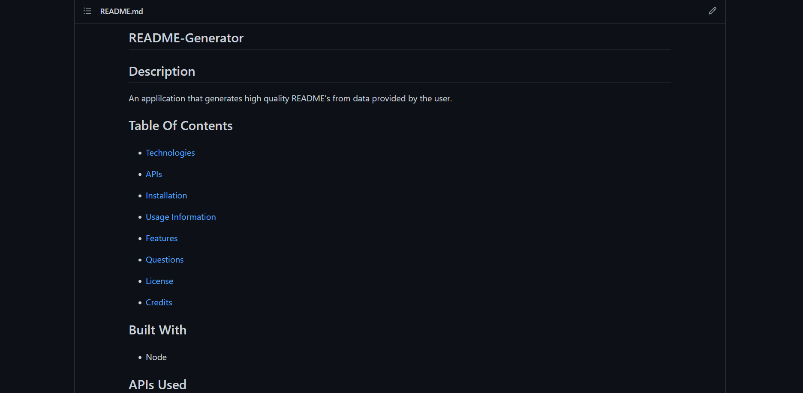

# Professional README Generator 

# Description
The purpose of this project was to generate a high quality README file from input from the user.  It enabled me to practice using node.js and to use the Inquirer package.

# Technologies Used
* Node.js
* Inquirer

# Installation
* Run the following command to install the appropriate dependencies: npm install

# Usage
* To run the code, type the following command: node index.js
* To run the code with a file instead of Inquirer: node index.js filename

# Features
* Upon starting the program the user will be asked a series of questions.
* The user will not be allowe to continue until an answer is provided for required questions.
* Some sections are optional and will require user confirmation before being added to the README
* The generated README will always appear in the distribution folderf (./dist)
* The user can also type the name of a file into the command line upon invoking the program to use thats file's data instead of Inquirer to get user input.
* An example of a data file can be found in the root directory (test.txt)

# Screenshots/Links

Github Repo: https://github.com/MirandaL27/README-Generator

# Walkthrough video
[video demo of README generator code](hw9-walkthrough-video.mp4)

# Credits
* Miranda Lane